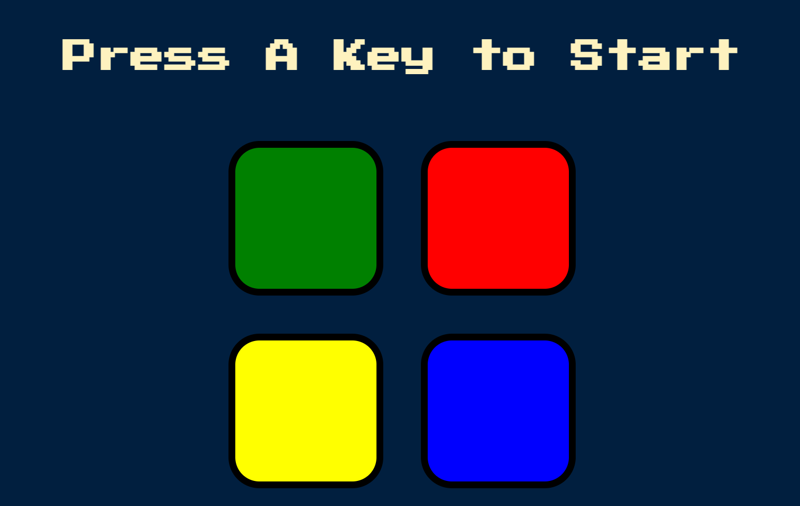
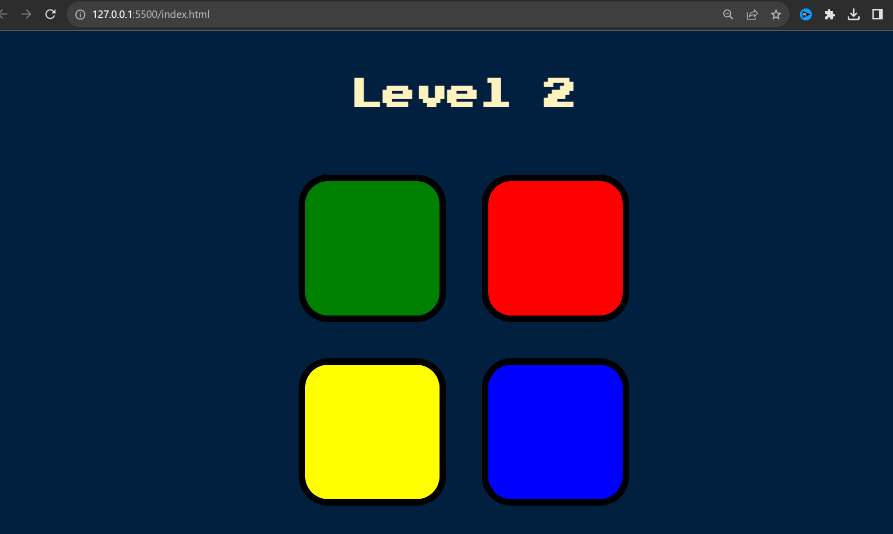
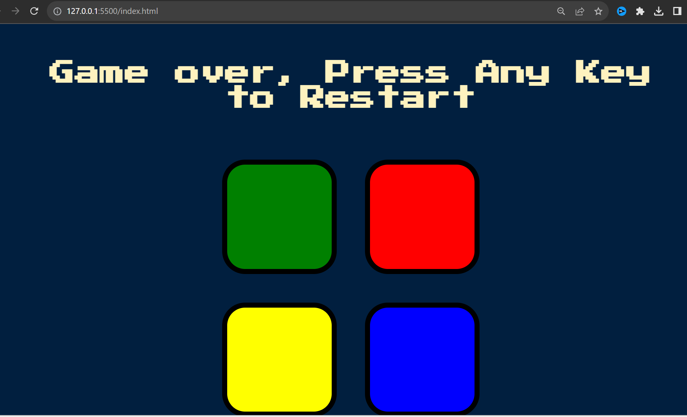

# SIMONDICEE-WEBSITE

Realizado por Eduardo Almachi 💕

Este juego consiste en seguir el patron que da la pagina y a su vez acordarse de la secuencia misma.

Pruebalo aqui: https://edusebass.github.io/SIMONDICEE-WEBSITE/

### Hecho con JavasScript y Jquery

Inicio del juego

Si completas la secuencia aumenta los niveles de memorizacion.

Si te equivocasse reinicia todo de nuevo

